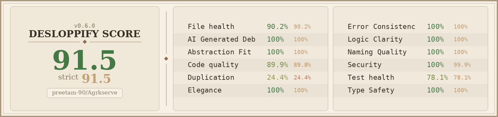

<p align="center">
  
</p>

<h1 align="center">
  <br>
  <code>&#x2588;&#x2588;&#x2588; DESLOPPIFY HEALTH REPORT &#x2588;&#x2588;&#x2588;</code>
  <br>
</h1>

<p align="center">
  <strong>Agrkserve</strong> &mdash; Full Codebase Quality Analysis
  <br>
  <code>Generated: February 20, 2026</code>
  <br><br>
  
  
  
  
</p>

<p align="center">
  
  
  
  
  
</p>

---

## `>` EXECUTIVE SUMMARY

```
  ╔══════════════════════════════════════════════════════════════╗
  ║                                                              ║
  ║    OVERALL HEALTH:  91.5 / 100                               ║
  ║    ████████████████████████████████████████████░░░░  91.5%    ║
  ║                                                              ║
  ║    Open Findings:   2,870                                    ║
  ║    Fixed:           0                                        ║
  ║    Won't Fix:       3                                        ║
  ║    Auto-Resolved:   527                                      ║
  ║    Total Tracked:   3,429                                    ║
  ║                                                              ║
  ╚══════════════════════════════════════════════════════════════╝
```

> **Score plateaued at 91.5 for 5 consecutive scans.** The biggest breakthrough opportunity lies in **Duplication (24.4%)** — currently the largest drag on the overall score at **-5.04 pts**. The strict/lenient gap is 0.0 pts with only 3 wontfix findings, indicating honest scoring.

---

## `>` DIMENSION SCORECARD

### Mechanical Dimensions (40% of overall)

| Dimension        | Score  | Strict | Visual                 | Tier | Checks | Issues | Action   |
| :--------------- | :----: | :----: | :--------------------- | :--: | :----: | :----: | :------- |
| **File Health**  | 90.2%  | 90.2%  | `██████████████████░░` |  T3  |  570   |   77   | Refactor |
| **Code Quality** | 89.9%  | 89.8%  | `██████████████████░░` |  T3  | 4,251  |  610   | Fix      |
| **Duplication**  | 24.4%  | 24.4%  | `█████░░░░░░░░░░░░░░░` |  T3  | 1,555  | 1,682  | Refactor |
| **Test Health**  | 78.1%  | 78.1%  | `████████████████░░░░` |  T4  | 7,168  |  500   | Refactor |
| **Security**     | 100.0% | 99.9%  | `████████████████████` |  T4  | 1,137  |   0    | Move     |

### Subjective Dimensions (60% of overall)

| Dimension             | Score  | Strict | Visual                 | Status       |
| :-------------------- | :----: | :----: | :--------------------- | :----------- |
| **AI Generated Debt** | 100.0% | 100.0% | `████████████████████` | Needs Review |
| **Abstraction Fit**   | 100.0% | 100.0% | `████████████████████` | Needs Review |
| **Elegance**          | 100.0% | 100.0% | `████████████████████` | Needs Review |
| **Error Consistency** | 100.0% | 100.0% | `████████████████████` | Needs Review |
| **Logic Clarity**     | 100.0% | 100.0% | `████████████████████` | Needs Review |
| **Naming Quality**    | 100.0% | 100.0% | `████████████████████` | Needs Review |
| **Type Safety**       | 100.0% | 100.0% | `████████████████████` | Needs Review |

> **Note:** Subjective dimensions default to 100% until reviewed. 450 files are awaiting subjective review. Running `desloppify review --prepare` and importing honest assessments will calibrate these scores.

---

## `>` SCORE IMPACT ANALYSIS

```
  Score Recipe: overall = 40% mechanical + 60% subjective
  Mechanical Pool Average:  78.8%
  Subjective Pool Average: 100.0% (unreviewed — defaults to 100%)

  ┌─────────────────────────────────────────────────────────┐
  │  WEIGHTED SCORE DRAGS                                   │
  │─────────────────────────────────────────────────────────│
  │  Duplication     -5.04 pts  (24.4%,  16.7% of mech)    │
  │  Test Health     -1.46 pts  (78.1%,  16.7% of mech)    │
  │  File Health     -1.31 pts  (90.2%,  33.3% of mech)    │
  │  Code Quality    -0.67 pts  (89.9%,  16.7% of mech)    │
  │  Security        -0.00 pts  (100%,   16.7% of mech)    │
  └─────────────────────────────────────────────────────────┘
```

```
  North Star:  91.5 → 95.0  (+3.5 pts needed)
  Primary Lever: Deduplicate boilerplate code
  Secondary: Improve test coverage on critical modules
```

---

## `>` FINDINGS BREAKDOWN BY TIER

```
  ┌──────┬──────────────────────────────────────────────────────────┬───────┬──────────┐
  │ TIER │ DESCRIPTION                                              │ OPEN  │ RESOLVED │
  ├──────┼──────────────────────────────────────────────────────────┼───────┼──────────┤
  │  T1  │ Auto-fixable (imports, logs, dead deprecated)            │     6 │ 42 (88%) │
  │  T2  │ Quick fixes (unused vars, dead exports, exact dupes)     │   209 │ 385 (65%)│
  │  T3  │ Judgment calls (smells, near-dupes, single-use, cycles)  │ 2,197 │ 132 (6%) │
  │  T4  │ Major refactors (structural decomp, import cycles)       │   458 │ 0 (0%)   │
  └──────┴──────────────────────────────────────────────────────────┴───────┴──────────┘
```

---

## `>` DETECTOR BREAKDOWN

| Detector                    | Open Findings | Impact                               | Priority            |
| :-------------------------- | :-----------: | :----------------------------------- | :------------------ |
| **Boilerplate Duplication** |     1,676     | Largest score drag (-5.04 pts)       | Critical            |
| **Subjective Review**       |      450      | 450 files unreviewed                 | High                |
| **Code Smells**             |      212      | Monster functions, silent catches    | High                |
| **Orphaned Files**          |      203      | Dead code / zero importers           | Medium              |
| **Unused Code**             |      158      | Unused imports & variables           | High (Auto-fixable) |
| **Structural**              |      77       | Large files, mixed concerns          | Medium              |
| **Test Coverage**           |      50       | Untested critical modules            | High                |
| **React Anti-patterns**     |      14       | State sync & boolean explosion       | Medium              |
| **Single-Use Modules**      |      13       | Over-abstracted single-consumer code | Low                 |
| **Near-Duplicates**         |       6       | 92-97% similar functions             | Medium              |
| **Facades**                 |       4       | Unused re-export barrels             | Low                 |
| **Security**                |       0       | All clear                            | None                |

---

## `>` CRITICAL FINDINGS

### 1. Boilerplate Duplication — 1,676 clusters

The **#1 score drag**. Repeated 4-line code blocks across 573 files. Most common patterns:

```
  HOTSPOTS (files with most duplication clusters):
  ┌───────────────────────────────────────────────────────────────────┐
  │  src/app/auth/reset-password/ResetPasswordClient.tsx  │ 124 hits │
  │  src/app/forgot-password/ForgotPasswordClient.tsx     │  ~100    │
  │  src/app/login/LoginClient.tsx                        │  ~100    │
  │  src/app/onboarding/OnboardingClient.tsx              │  ~80     │
  │  src/app/phone-setup/PhoneSetupClient.tsx             │  ~80     │
  └───────────────────────────────────────────────────────────────────┘

  Pattern: Auth-related forms share massive boilerplate in:
    - Form field layouts & validation feedback
    - Gradient backgrounds & animated decorations
    - Loading states & success animations
    - Error handling & toast patterns
```

**Recommendation:** Extract shared auth form components: `AuthFormLayout`, `AuthField`, `AuthBackground`, `AuthSuccessState`. This alone could resolve 500+ duplication findings.

---

### 2. Unused Code — 158 findings (Auto-fixable)

```
  AUTO-FIX AVAILABLE:
  $ desloppify fix unused-imports --dry-run    # Preview
  $ desloppify fix unused-imports              # Apply

  TOP OFFENDERS:
  ┌──────────────────────────────────────────────────────────┬──────┐
  │  src/components/ai-elements/model-selector.tsx           │  11  │
  │  src/lib/utils/constants.ts                              │   9  │
  │  src/hooks/useAccessibility.tsx                          │   8  │
  │  src/components/ai-elements/prompt-input.tsx             │   7  │
  │  src/components/landing/shared/useScrollAnimations.ts    │   7  │
  │  src/app/labour/LabourClient.tsx                         │   7  │
  │  src/lib/device-detection.ts                             │   5  │
  │  src/lib/seo/blog-schemas.ts                             │   5  │
  └──────────────────────────────────────────────────────────┴──────┘
```

---

### 3. Monster Functions — 40+ files

Components exceeding 150 LOC in a single function — hard to test, review, and maintain.

```
  LARGEST MONSTER FUNCTIONS:
  ┌──────────────────────────────────────────────────────────┬──────┐
  │  src/app/equipment/EquipmentClient.tsx                   │ 1558 │
  │  src/app/labour/LabourClient.tsx                         │ 1306 │
  │  src/app/about/AboutClient.tsx                           │ 1273 │
  │  src/app/admin/settings/SettingsClient.tsx               │ 1020 │
  │  src/app/admin/analytics/AnalyticsClient.tsx             │  918 │
  │  src/app/admin/storage/StorageClient.tsx                 │  793 │
  │  src/app/equipment/item/[id]/book/BookEquipmentClient    │  730 │
  │  src/app/equipment/item/[id]/EquipmentDetailClient       │  658 │
  │  src/app/help/HelpClient.tsx                             │  615 │
  └──────────────────────────────────────────────────────────┴──────┘
```

**Recommendation:** Decompose into smaller sub-components, custom hooks, and utility functions. Extract data-fetching logic into hooks, UI sections into composable components.

---

### 4. Test Coverage Gaps — 50 untested modules

```
  CRITICAL UNTESTED (by LOC):
  ┌──────────────────────────────────────────────────────────┬──────┐
  │  src/lib/services/smart-query-service.ts                 │ 2960 │
  │  src/app/equipment/EquipmentClient.tsx                   │ 1558 │
  │  src/app/labour/LabourClient.tsx                         │ 1306 │
  │  src/app/about/AboutClient.tsx                           │ 1273 │
  │  src/app/admin/settings/SettingsClient.tsx               │ 1020 │
  │  src/app/admin/analytics/AnalyticsClient.tsx             │  918 │
  │  src/app/admin/storage/StorageClient.tsx                 │  793 │
  │  src/app/equipment/item/[id]/book/BookEquipmentClient    │  730 │
  │  src/app/equipment/item/[id]/EquipmentDetailClient       │  658 │
  │  src/app/help/HelpClient.tsx                             │  615 │
  └──────────────────────────────────────────────────────────┴──────┘

  Priority: smart-query-service.ts (2960 LOC, critical service, T2)
```

---

### 5. React Anti-patterns — 14 findings

#### State Sync Anti-patterns (6 instances)

`useEffect` that only calls a single setter — often indicates derived state that should be computed directly.

```
  AFFECTED FILES:
  - src/app/help/HelpClient.tsx                   → setMounted
  - src/app/not-found-client.tsx                  → setMounted
  - src/app/settings/roles/RolesSettingsClient.tsx → setEnabledRoles
  - src/components/layout/header.tsx              → setMobileMenuOpen
  - src/components/notifications/NotificationsSearch.tsx → setLocalValue
  - src/components/ui/media-upload.tsx            → setUploadedFiles
```

#### Boolean State Explosion (8 instances)

Components with 3-8 boolean `useState` hooks that should be consolidated into a state machine or reducer.

```
  WORST OFFENDERS:
  - src/app/admin/settings/SettingsClient.tsx  → 8 boolean states
  - src/app/labour/LabourClient.tsx            → 4 boolean states
  - src/app/auth/reset-password/ResetPasswordClient.tsx → 4 boolean states
  - src/app/equipment/EquipmentClient.tsx      → 3 boolean states
```

---

### 6. Near-Duplicate Functions — 6 clusters

```
  ┌─────────────────────────────────────────────────────────────────────────┐
  │  ContactCard        (privacy)  ←→  ContactCard        (terms)  │ 93%  │
  │  PrivacyAccordion   (privacy)  ←→  TermsAccordion     (terms)  │ 97%  │
  │  TableOfContents    (privacy)  ←→  TableOfContents    (terms)  │ 96%  │
  │  subscribe          (hooks)    ←→  subscribe          (device) │ 92%  │
  │  imageCount         (cloudinary:218) ←→ imageCount    (:276)   │ 92%  │
  │  getImageDimensions (compress) ←→  getImageDimensions (utils)  │ 93%  │
  └─────────────────────────────────────────────────────────────────────────┘
```

**Recommendation:** Extract shared legal page components. Consolidate utility functions.

---

### 7. Structural Issues — 77 findings

Files needing decomposition due to size or mixed concerns:

```
  CONCERN MIXING:
  - jsx_rendering + data_fetching + handlers(9)     → MediaClient.tsx
  - jsx_rendering + data_fetching + data_transforms(9) → admin/page.tsx
  - jsx_rendering + data_fetching + data_transforms(7) → UserDetailClient.tsx
  - jsx_rendering + data_fetching + data_transforms(5) → ReviewsClient.tsx

  HOOK OVERLOAD:
  - MediaClient.tsx: 12 hooks (11 useStates, 12 total)
```

---

### 8. Orphaned Files — 203 files

Files with zero importers that aren't entry points. Many are Next.js `page.tsx` files (legitimate entry points, false positives), but others are genuine dead code.

```
  LIKELY DEAD CODE:
  - .agents/types/agent-definition.ts           (418 LOC)
  - docs/examples/equipment-with-3d.tsx         (56 LOC)
  - docs/examples/layout-integration.tsx        (26 LOC)
  - src/components/SmoothScroll.tsx
  - src/components/landing-v2/* (multiple)
  - src/components/landing/ScrollStory/* (multiple)
```

---

### 9. Dead Facades — 4 barrel files with 0 importers

```
  UNUSED BARREL FILES (safe to delete):
  - src/components/invoice/index.ts       → 0 importers
  - src/components/product/index.ts       → 0 importers
  - src/lib/supabase/index.ts             → 0 importers

  UNDERUSED:
  - src/components/notifications/index.ts → 1 importer (could inline)
```

---

## `>` STRUCTURAL DEBT BY AREA

```
  ┌──────────────────────────────┬───────┬────────────────────┬────────┐
  │ AREA                         │ ITEMS │ TIERS              │ WEIGHT │
  ├──────────────────────────────┼───────┼────────────────────┼────────┤
  │ src/app                      │ 1,706 │ T3: 1550  T4: 156  │  5,274 │
  │ src/components               │   733 │ T3: 507   T4: 226  │  2,425 │
  │ src/lib                      │   189 │ T3: 125   T4: 64   │    631 │
  │ src/hooks                    │     9 │ T3: 5     T4: 4    │     31 │
  │ docs/examples                │     7 │ T3: 5     T4: 2    │     23 │
  │ .agents/types                │     4 │ T3: 1     T4: 3    │     15 │
  │ src/data                     │     3 │ T3: 2     T4: 1    │     10 │
  │ src/proxy.ts                 │     2 │ T3: 1     T4: 1    │      7 │
  │ next.config.ts               │     1 │ T3: 1     T4: 0    │      3 │
  └──────────────────────────────┴───────┴────────────────────┴────────┘
```

---

## `>` SECURITY STATUS

```
  ╔══════════════════════════════════════════════════════╗
  ║                                                      ║
  ║   SECURITY SCORE:  100.0%  (strict: 99.9%)          ║
  ║   ████████████████████████████████████████  100%     ║
  ║                                                      ║
  ║   1,137 checks passed                               ║
  ║   0 open security findings                           ║
  ║   Status: ALL CLEAR                                  ║
  ║                                                      ║
  ╚══════════════════════════════════════════════════════╝
```

---

## `>` WONTFIX DEBT

```
  Total Wontfix:  3 items
  Impact:         0.0 pts gap between lenient and strict scores
  Status:         Negligible — no score pressure from wontfix decisions
```

---

## `>` RECOMMENDED ACTION PLAN

### Phase 1 — Quick Wins (Estimated: 1 hour)

```
  PRIORITY  ACTION                                          IMPACT
  ────────  ──────────────────────────────────────────────  ──────────
  [P0]      Run `desloppify fix unused-imports`             -158 findings
  [P0]      Delete unused barrel files (3 facades)          -3 findings
  [P0]      Run `desloppify fix dead-useeffect --dry-run`   ~6 React fixes
```

### Phase 2 — Deduplication Sprint (Estimated: 1-2 days)

```
  PRIORITY  ACTION                                          IMPACT
  ────────  ──────────────────────────────────────────────  ──────────
  [P1]      Extract shared auth form components             -500+ duplication
  [P1]      Merge privacy/terms shared components           -6 near-dupes
  [P1]      Consolidate utility duplicates                  -2 near-dupes
  [P1]      Deduplicate boilerplate in admin clients        -200+ duplication
```

### Phase 3 — Structural Refactoring (Estimated: 1 week)

```
  PRIORITY  ACTION                                          IMPACT
  ────────  ──────────────────────────────────────────────  ──────────
  [P2]      Decompose 40+ monster functions                 -40 smells
  [P2]      Separate concerns in mixed-responsibility files -20 structural
  [P2]      Clean up orphaned/dead code                     -50+ orphaned
  [P2]      Add tests for smart-query-service.ts (2960 LOC) -1 test gap
```

### Phase 4 — Subjective Review (Estimated: 2 hours)

```
  PRIORITY  ACTION                                          IMPACT
  ────────  ──────────────────────────────────────────────  ──────────
  [P3]      Run `desloppify review --prepare`               Calibrate scores
  [P3]      Complete blind review for 7 dimensions          Honest baselines
  [P3]      Import review & rescan                          Adjusted overall
```

---

## `>` COMMANDS QUICK REFERENCE

```bash
# Scan & Status
desloppify scan --path .                    # Full project scan
desloppify status                           # Score summary
desloppify next --count 20                  # Top 20 priorities

# Investigate
desloppify show <detector>                  # Filter by detector type
desloppify show <file-path>                 # Filter by file
desloppify plan                             # Full prioritized plan

# Auto-Fix (ALWAYS dry-run first!)
desloppify fix unused-imports --dry-run     # Preview unused import removal
desloppify fix dead-useeffect --dry-run     # Preview dead useEffect removal
desloppify fix unused-imports               # Apply fixes

# Resolve
desloppify resolve fixed "<id>"             # Mark as fixed
desloppify resolve wontfix "<id>" --note "" # Mark as intentional

# Subjective Review
desloppify review --prepare                 # Generate review data
desloppify review --import results.json     # Import review scores
```

---

## `>` SCORE TRAJECTORY

```
  Current:   91.5 / 100  ██████████████████████████████████████████████░░░░
  Target:    95.0 / 100  ██████████████████████████████████████████████████

  Gap:       +3.5 pts needed

  Path to 95.0:
  ├── Fix Duplication (24.4% → 60%)  ≈ +2.4 pts
  ├── Fix Test Health (78.1% → 85%)  ≈ +0.5 pts
  ├── Fix File Health (90.2% → 95%)  ≈ +0.4 pts
  └── Fix Code Quality (89.9% → 95%) ≈ +0.3 pts
                                       ────────
                                       ≈ +3.6 pts → 95.1 target achievable
```

---

<p align="center">
  <sub>
    <strong>Generated by <a href="https://github.com/peteromallet/desloppify">Desloppify</a></strong>
    &nbsp;&bull;&nbsp;
    Scan Date: February 20, 2026
    &nbsp;&bull;&nbsp;
    573 files analyzed
    &nbsp;&bull;&nbsp;
    117K LOC scanned
  </sub>
</p>

<p align="center">
  <code>&#x2588;&#x2588;&#x2588; END OF REPORT &#x2588;&#x2588;&#x2588;</code>
</p>
