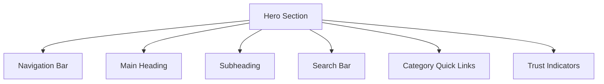
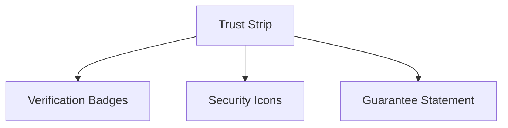
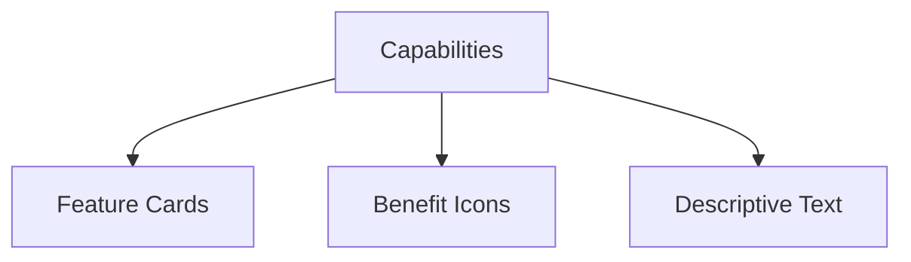
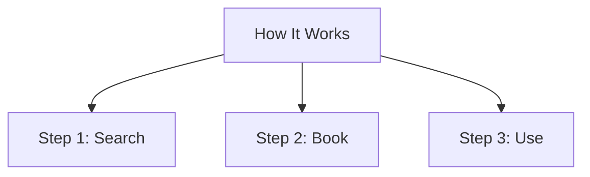
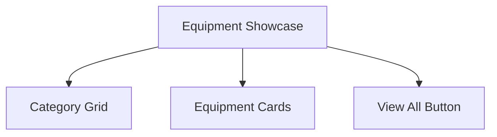
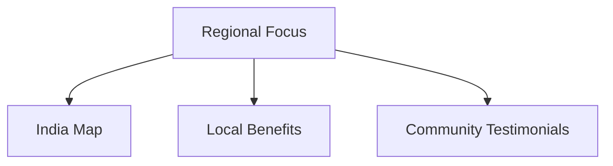
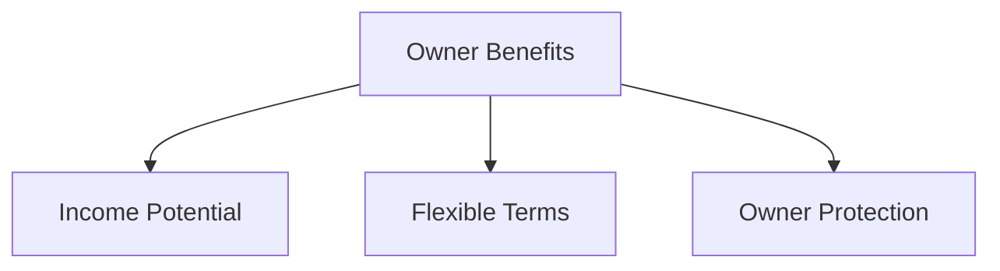
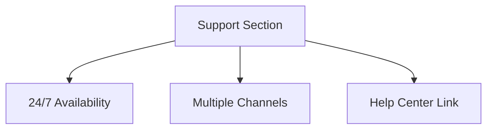
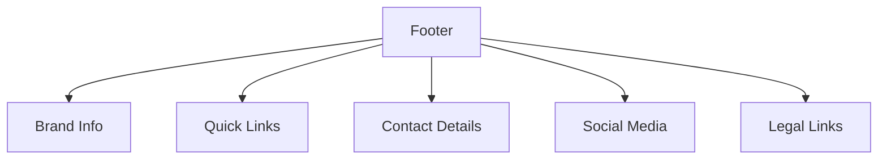

# Agriculture Equipment Rental Platform - Landing Page Redesign

## Design Goals
- **Desktop-first approach** with full responsiveness
- **Clean and professional appearance** that builds trust
- **Clear visual hierarchy** for easy navigation
- **Color palette consistency** with existing branding
- **Typography** that enhances readability and professionalism

## Color Palette
Based on the existing design, we'll use:
- **Primary**: Teal/Green gradient (#008080 to #2E8B57)
- **Secondary**: Yellow accent (#FFD700)
- **Backgrounds**: White (#FFFFFF), Light gray (#F5F5F5)
- **Text**: Dark gray (#333333), Medium gray (#666666)
- **Accents**: Green (#1B5E20), Light teal (#E0F2F1)

## Typography
- **Headings**: Inter Bold (700 weight)
- **Body**: Inter Regular (400 weight)
- **Accent**: Inter Medium (500 weight)

## Layout Structure

### 1. Hero Section
**Purpose**: Immediately communicate value proposition and provide search functionality

**Design Specifications**:
- Full-width gradient background (teal to blue)
- Centered content with max-width container
- Large brand logo with tractor icon
- Main heading: "Put Your Equipment to Work!"
- Subheading: "Turn underused items into income. From tractors to harvesters, AgriServe connects owners and renters India-wide with fast delivery, secure payments, and real rewards."
- Prominent search bar with location, dates, and category filters
- Quick category chips for popular equipment types
- Live user and listing counters for social proof

### 2. Trust & Reliability Strip
**Purpose**: Build immediate credibility

**Design Specifications**:
- Thin horizontal strip below hero
- Light background with dark text
- Icons for verification, security, and guarantee
- Short statements like "Protected by AgriServe Guarantee"
- "Verified Providers Only" badge
- "Secure Payments" icon

### 3. Platform Capabilities Overview
**Purpose**: Showcase key features and benefits

**Design Specifications**:
- Section title: "Why Choose AgriServe?"
- Grid layout (3 columns on desktop, 2 on tablet, 1 on mobile)
- Each card has icon, title, and description
- Features to highlight:
  - Location-Based Search
  - Verified Providers
  - Flexible Rentals
  - Secure Payments
  - Easy Booking
  - 24/7 Support

### 4. How It Works Section
**Purpose**: Simplify user understanding of the process

**Design Specifications**:
- Section title: "How It Works"
- 3-step horizontal process
- Each step has:
  - Number badge (1, 2, 3)
  - Icon representing the step
  - Title and description
  - Visual indicator of progress
- Background: Light gradient for visual separation

### 5. Popular Equipment Showcase
**Purpose**: Display available inventory and drive engagement

**Design Specifications**:
- Section title: "Explore Categories"
- Grid of equipment categories (5 columns on desktop)
- Each category card shows:
  - Icon
  - Category name
  - Item count
  - Hover effect
- "View All Equipment" call-to-action

### 6. Regional & Local Focus
**Purpose**: Emphasize hyperlocal nature of the platform

**Design Specifications**:
- Section title: "Serving Farmers Across India"
- Interactive map showing coverage areas
- Testimonials from different regions
- Local language support highlights
- Community impact statistics

### 7. Equipment Owner Benefits
**Purpose**: Encourage equipment owners to list their items

**Design Specifications**:
- Section title: "Why List Your Equipment?"
- Dual-column layout (text + visual)
- Benefits highlighted:
  - Earn extra income
  - Flexible rental terms
  - Equipment protection
  - Easy management
- Call-to-action: "List Your Equipment"

### 8. Support & Help Section
**Purpose**: Build confidence through support availability

**Design Specifications**:
- Section title: "We're Here to Help"
- Support channels icons (phone, chat, email)
- FAQ preview with common questions
- Help center search bar
- Contact information

### 9. Redesigned Footer
**Purpose**: Provide comprehensive navigation and contact information

**Design Specifications**:
- Dark background with light text
- 4-column layout:
  - Brand info with logo and description
  - Product links (Equipment, Labour, etc.)
  - Company links (About, Blog, Careers)
  - Support links (Help, Safety, Terms)
- Contact information with phone, email, address
- Social media icons
- Copyright notice

## Responsive Design Approach

### Desktop (>1200px)
- Full-width sections with max-width content containers
- Multi-column layouts (3-5 columns)
- Horizontal navigation
- Side-by-side content presentation

### Tablet (768px-1200px)
- Reduced column count (2-3 columns)
- Adjusted spacing and padding
- Stacked content where needed

### Mobile (<768px)
- Single column layout
- Stacked sections
- Mobile-friendly navigation
- Touch-friendly buttons and controls

## Visual Hierarchy Principles

1. **Size**: Larger elements for primary actions and headings
2. **Color**: High contrast for important elements, muted for secondary
3. **Spacing**: Generous white space around key sections
4. **Typography**: Bold headings, regular body text, accent for calls-to-action
5. **Position**: Important elements positioned for natural reading flow

## Implementation Plan

1. **Component Reusability**: Leverage existing UI components (Card, Button, etc.)
2. **Consistent Styling**: Use Tailwind CSS classes for uniformity
3. **Animation**: Subtle hover effects and transitions for interactivity
4. **Performance**: Optimized images and lazy loading for fast page load
5. **Accessibility**: Proper contrast, ARIA labels, and keyboard navigation

## Next Steps

1. Create wireframes for each section
2. Develop high-fidelity mockups
3. Implement responsive design
4. Test across devices and browsers
5. Gather feedback and iterate

This design plan ensures a professional, trustworthy, and user-friendly landing page that effectively communicates the value of the Agriculture Equipment Rental Platform while driving user engagement and conversions.