# Agriculture Equipment Rental Platform - Landing Page Wireframe

## Overall Page Structure


## Detailed Section Wireframes

### 1. Hero Section Wireframe

```mermaid
flowchart TD
    subgraph HeroSection[Hero Section - Full Width]
        direction TB
        NavBar[Navigation Bar: Logo + Menu Items + Auth Buttons]
        
        subgraph HeroContent[Main Content Area]
            LogoArea[Brand Logo with Tractor Icon]
            MainHeading["Put Your Equipment to Work!"]
            Subheading["Turn underused items into income..."]
            
            SearchArea[Search Bar with 4 Fields + CTA Button]
            SearchField1[What to rent?]
            SearchField2[Location]
            SearchField3[Dates]
            SearchField4[Category]
            SearchButton[Search Button]
            
            CategoryChips[Quick Category Links: Tractors, Harvesters, Tools, etc.]
            
            TrustBadges[Live Stats: 4,547 Users | 1,291 Listings]
        end
        
        NavBar --> HeroContent
    end
```

### 2. Trust & Reliability Strip

```mermaid
flowchart TD
    subgraph TrustStrip[Trust Strip - Thin Horizontal]
        direction TB
        
        VerifiedBadge["✓ Verified Providers Only"]
        SecurePayments["🔒 Secure Payments"]
        Guarantee["🛡️ Protected by AgriServe Guarantee"]
        
        VerifiedBadge --> SecurePayments --> Guarantee
    end
```



### 3. Platform Capabilities Overview

```mermaid
flowchart TD
    subgraph Capabilities[Why Choose AgriServe?]
        direction TB
        
        SectionTitle["Why Choose AgriServe?"]
        SectionSubtitle["We make agricultural equipment accessible..."]
        
        subgraph FeaturesGrid[3-Column Grid]
            Feature1[Location-Based Search
            "📍 Find equipment near your farm"]
            Feature2[Verified Providers
            "✓ All providers verified"]
            Feature3[Flexible Rentals
            "⏱️ Rent by hour or day"]
            Feature4[Secure Payments
            "💳 Safe payment processing"]
            Feature5[Easy Booking
            "📱 Simple booking process"]
            Feature6[24/7 Support
            "🎧 Always ready to help"]
        end
        
        SectionTitle --> FeaturesGrid
    end
```

### 4. How It Works Section

```mermaid
flowchart TD
    subgraph HowItWorks[How It Works - 3 Steps]
        direction TB
        
        SectionTitle2["How It Works"]
        SectionSubtitle2["Getting started is easy..."]
        
        subgraph Steps[Horizontal 3-Step Process]
            Step1[🔍 Search & Discover
            "Browse our catalog..."]
            Step2[💳 Book & Pay
            "Select dates and pay..."]
            Step3[✅ Use & Return
            "Pick up, use, return..."]
        end
        
        SectionTitle2 --> Steps
    end
```

### 5. Popular Equipment Showcase

```mermaid
flowchart TD
    subgraph EquipmentShowcase[Explore Categories]
        direction TB
        
        SectionTitle3["Explore Categories"]
        SectionSubtitle3["Discover what you can rent"]
        
        subgraph CategoryGrid[5-Column Grid]
            Cat1[Tractors
            "🚜 142 items"]
            Cat2[Harvesters
            "🌾 27 items"]
            Cat3[Tools & Equipment
            "🔧 75 items"]
            Cat4[Irrigation
            "💧 231 items"]
            Cat5[Sprayers
            "🚿 2 items"]
            Cat6[Services
            "🛠️ 82 items"]
            Cat7[Seeds & Supplies
            "🌱 34 items"]
            Cat8[Drones & Cameras
            "📷 13 items"]
            Cat9[Storage & Shelter
            "⛺ 39 items"]
            Cat10[Labour & Support
            "💪 7 items"]
        end
        
        ViewAll[View All Equipment Button]
        
        SectionTitle3 --> CategoryGrid --> ViewAll
    end
```

### 6. Regional & Local Focus

```mermaid
flowchart TD
    subgraph RegionalFocus[Serving Farmers Across India]
        direction TB
        
        SectionTitle4["Serving Farmers Across India"]
        
        subgraph ContentArea[Dual Column Layout]
            MapArea[Interactive India Map
            "Showing coverage areas"]
            
            Testimonials[Customer Testimonials
            "⭐⭐⭐⭐⭐ "Great service!"
            - Farmer from Punjab
            
            ⭐⭐⭐⭐⭐ "Easy to use"
            - Farmer from Maharashtra"]
        end
        
        Stats[Community Impact Stats
            "5,000+ Happy Farmers
            10,000+ Equipment Listings
            500+ Villages Covered"]
        
        SectionTitle4 --> ContentArea --> Stats
    end
```

### 7. Equipment Owner Benefits

```mermaid
flowchart TD
    subgraph OwnerBenefits[Why List Your Equipment?]
        direction TB
        
        SectionTitle5["Why List Your Equipment?"]
        
        subgraph BenefitsLayout[Dual Column]
            TextContent["Earn Extra Income
            Flexible Rental Terms
            Equipment Protection
            Easy Management"]
            
            VisualContent[Equipment Owner Image
            "Happy farmer with equipment"]
        end
        
        CTAButton[List Your Equipment Button]
        
        SectionTitle5 --> BenefitsLayout --> CTAButton
    end
```

### 8. Support & Help Section

```mermaid
flowchart TD
    subgraph SupportSection[We're Here to Help]
        direction TB
        
        SectionTitle6["We're Here to Help"]
        
        subgraph SupportChannels[Support Options]
            Phone[📞 Phone Support
            "+91 1800-XXX-XXXX"]
            Chat[💬 Live Chat
            "Available 24/7"]
            Email[✉️ Email Support
            "support@agriserve.in"]
        end
        
        FAQPreview[Frequently Asked Questions
            "Q: How do I rent equipment?
            A: Search, book, and use in 3 easy steps!"]
        
        HelpSearch[Help Center Search Bar]
        
        SectionTitle6 --> SupportChannels --> FAQPreview --> HelpSearch
    end
```

### 9. Footer Design

```mermaid
flowchart TD
    subgraph Footer[Footer - Dark Background]
        direction TB
        
        subgraph FooterContent[4-Column Layout]
            BrandColumn[Brand Info
            "Logo + Description
            Contact: 📧 📞 📍"]
            
            ProductColumn[Product
            "Equipment Rental
            Labour Services
            For Providers
            Pricing"]
            
            CompanyColumn[Company
            "About Us
            Blog
            Careers
            Contact"]
            
            SupportColumn[Support
            "Help Center
            Safety
            Terms of Service
            Privacy Policy"]
        end
        
        SocialMedia[Social Media Icons
            "Facebook, Twitter, Instagram, YouTube"]
        
        Copyright["© 2026 AgriServe. All rights reserved."]
        
        FooterContent --> SocialMedia --> Copyright
    end
```

## Responsive Behavior

```mermaid
flowchart TD
    subgraph ResponsiveDesign[Responsive Breakpoints]
        direction TB
        
        Desktop[Desktop: >1200px
        "Full multi-column layouts
        Horizontal navigation
        Side-by-side content"]
        
        Tablet[Tablet: 768-1200px
        "2-3 column layouts
        Adjusted spacing
        Some stacked content"]
        
        Mobile[Mobile: <768px
        "Single column layout
        Stacked sections
        Mobile menu
        Touch-friendly controls"]
        
        Desktop --> Tablet --> Mobile
    end
```

## Visual Design Elements

### Color Usage


### Typography Hierarchy
```mermaid
flowchart TD
    H1[H1: 48-60px Bold
    "Main section titles"]
    H2[H2: 36-42px SemiBold
    "Subsection titles"]
    H3[H3: 24-30px Medium
    "Feature titles"]
    Body[Body: 16-18px Regular
    "Main content text"]
    Small[Small: 14px Regular
    "Captions, labels"]
    
    H1 --> H2 --> H3 --> Body --> Small
```

## Implementation Notes

1. **Component Reuse**: Maximize use of existing UI components (Card, Button, Badge)
2. **Consistent Spacing**: Use Tailwind's spacing scale (4, 6, 8, 12, 16, 20, 24)
3. **Animation**: Subtle hover effects (scale, shadow, color change)
4. **Accessibility**: Proper contrast ratios, ARIA labels, keyboard navigation
5. **Performance**: Optimized images, lazy loading, minimal JavaScript

This wireframe provides a comprehensive blueprint for implementing the redesigned landing page with a focus on desktop-first usability and full responsiveness.