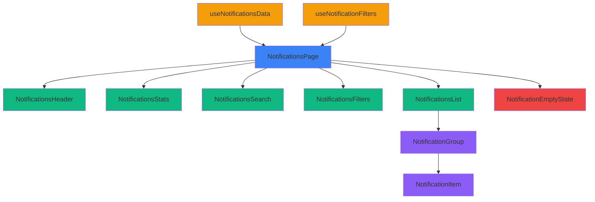

# Notifications Page Redesign Plan

> **Project:** AgriServe Notifications Center
> **Generated:** 2026-02-06
> **Category:** SaaS Dashboard - Notifications Center

---

## Current State Analysis

### Existing Implementation
- **File:** [`src/app/notifications/page.tsx`](src/app/notifications/page.tsx)
- **Component:** [`src/components/notifications/notification-item.tsx`](src/components/notifications/notification-item.tsx)
- **Theme:** Dark mode with glassmorphism effects
- **Features:**
  - Stats cards (Total, Unread, Read Rate, This Week)
  - Search functionality
  - Filter system (NotificationFilters component)
  - Tab navigation (All, Unread, Read)
  - Grouped notifications by date (Today, Yesterday, Earlier)
  - Mark all read / Clear all actions
  - Individual notification actions (mark read, delete)

### Issues Identified
1. **Hydration Error:** Fixed - CardDescription contained `<div>` elements
2. **Performance:** Multiple useMemo hooks could be optimized
3. **Accessibility:** Some focus states and ARIA attributes could be improved
4. **Component Organization:** Large single file (536 lines) - could be split
5. **Visual Hierarchy:** Stats cards could be more scannable
6. **Mobile Experience:** Some elements may not be optimized for small screens

---

## Design System Recommendations

### Color Palette (Dark Mode Optimized)

| Role | Hex | CSS Variable | Usage |
|------|-----|--------------|-------|
| Primary | `#0F172A` | `--color-primary` | Backgrounds, cards |
| Secondary | `#1E293B` | `--color-secondary` | Secondary backgrounds |
| Accent Blue | `#3B82F6` | `--color-accent-blue` | Primary actions, links |
| Accent Emerald | `#10B981` | `--color-accent-emerald` | Success states |
| Accent Red | `#EF4444` | `--color-accent-red` | Critical notifications |
| Accent Purple | `#8B5CF6` | `--color-accent-purple` | Insights, analytics |
| Text Primary | `#F8FAFC` | `--color-text-primary` | Headings, important text |
| Text Secondary | `#94A3B8` | `--color-text-secondary` | Body text, descriptions |
| Text Muted | `#64748B` | `--color-text-muted` | Timestamps, metadata |

### Typography

- **Heading Font:** Inter (Google Fonts)
- **Body Font:** Inter (Google Fonts)
- **Mood:** Modern, clean, professional, data-focused
- **Google Fonts:** [Inter](https://fonts.google.com/share?selection?family=Inter:wght@400;500;600;700)

**CSS Import:**
```css
@import url('https://fonts.googleapis.com/css2?family=Inter:wght@400;500;600;700&display=swap');
```

### Spacing Variables

| Token | Value | Usage |
|-------|-------|-------|
| `--space-xs` | `4px` / `0.25rem` | Tight gaps, icon spacing |
| `--space-sm` | `8px` / `0.5rem` | Small padding, inline gaps |
| `--space-md` | `16px` / `1rem` | Standard padding |
| `--space-lg` | `24px` / `1.5rem` | Section padding |
| `--space-xl` | `32px` / `2rem` | Large gaps |
| `--space-2xl` | `48px` / `3rem` | Section margins |

### Shadow Depths (Dark Mode)

| Level | Value | Usage |
|-------|-------|-------|
| `--shadow-sm` | `0 1px 2px rgba(0,0,0,0.3)` | Subtle lift |
| `--shadow-md` | `0 4px 6px rgba(0,0,0,0.4)` | Cards, buttons |
| `--shadow-lg` | `0 10px 15px rgba(0,0,0,0.5)` | Modals, dropdowns |
| `--shadow-xl` | `0 20px 25px rgba(0,0,0,0.6)` | Hero elements |

### Glassmorphism Effects

```css
.glass-card {
  background: rgba(15, 23, 42, 0.6);
  backdrop-filter: blur(20px);
  border: 1px solid rgba(255, 255, 255, 0.05);
}

.glass-header {
  background: rgba(30, 41, 59, 0.3);
  backdrop-filter: blur(10px);
  border: 1px solid rgba(255, 255, 255, 0.05);
}
```

---

## Component Improvements

### 1. Stats Cards Enhancement

**Current Issues:**
- Progress bars are decorative only
- Hover effects could be more meaningful
- Mobile layout could be improved

**Improvements:**
- Add meaningful hover states (expand to show details)
- Improve mobile stacking
- Add subtle animations on load
- Better visual hierarchy with icons

### 2. Notification Item Component

**Current Issues:**
- Delete button only visible on hover (accessibility concern)
- Could benefit from better keyboard navigation
- Animation on delete could be smoother

**Improvements:**
- Make delete button always visible on mobile, hover on desktop
- Add keyboard shortcuts (Delete key)
- Improve swipe-to-delete on mobile
- Better focus states for keyboard navigation

### 3. Search and Filters

**Current Issues:**
- Filter panel is hidden by default
- Could benefit from quick filter chips
- Search could have debouncing

**Improvements:**
- Add quick filter chips (All, Unread, Read, Bookings, Messages, Payments)
- Implement search debouncing (300ms)
- Add filter count badges
- Persist filter state in URL

### 4. Empty States

**Current Issues:**
- Good but could be more engaging
- Could suggest actions

**Improvements:**
- Add micro-interactions
- Suggest relevant actions based on context
- Add subtle animations

---

## Performance Optimizations (Vercel Best Practices)

### 1. Eliminate Waterfalls

**Current:**
```typescript
const { notifications, unreadCount, loading, error, ... } = useNotifications(filters);
const { stats } = useNotificationStats();
```

**Optimized:**
```typescript
// Parallel data fetching
const [notificationsData, statsData] = await Promise.all([
  fetchNotifications(filters),
  fetchNotificationStats()
]);
```

### 2. Bundle Size Optimization

**Actions:**
- Use `next/dynamic` for heavy components
- Lazy load NotificationFilters
- Defer non-critical analytics

### 3. Re-render Optimization

**Actions:**
- Extract stats cards into memoized components
- Use `useTransition` for non-urgent updates
- Implement virtual scrolling for long lists (100+ notifications)

### 4. Rendering Performance

**Actions:**
- Use `content-visibility: auto` for notification groups
- Hoist static JSX outside components
- Implement skeleton loading states

---

## Accessibility Improvements

### 1. Keyboard Navigation

**Add:**
- Tab navigation through notifications
- Enter/Space to open notification
- Delete key to remove notification
- Escape to close filters

### 2. ARIA Attributes

**Add:**
- `aria-live` regions for dynamic content
- `aria-label` for icon-only buttons
- `aria-describedby` for notification details
- `role="list"` and `role="listitem"` for notification lists

### 3. Focus Management

**Add:**
- Visible focus states on all interactive elements
- Focus trap in modals
- Focus restoration after actions

### 4. Screen Reader Support

**Add:**
- Announce notification count changes
- Announce filter changes
- Provide context for grouped notifications

---

## Responsive Design Improvements

### Mobile (< 640px)
- Stack stats cards vertically
- Simplify header (hide secondary actions in menu)
- Full-width search input
- Bottom sheet for filters
- Swipe actions for notifications

### Tablet (640px - 1024px)
- 2x2 grid for stats cards
- Compact header layout
- Side panel for filters

### Desktop (> 1024px)
- 4-column stats grid
- Full header with all actions
- Inline filter panel

---

## Component Architecture

### Proposed Structure

```
src/app/notifications/
├── page.tsx (main page - simplified)
├── components/
│   ├── NotificationsHeader.tsx
│   ├── NotificationsStats.tsx
│   ├── NotificationsSearch.tsx
│   ├── NotificationsFilters.tsx
│   ├── NotificationsList.tsx
│   ├── NotificationGroup.tsx
│   └── NotificationEmptyState.tsx
└── hooks/
    ├── useNotificationsData.ts
    └── useNotificationFilters.ts
```

### Component Responsibilities

| Component | Responsibility |
|-----------|---------------|
| `NotificationsHeader` | Page title, settings link, mark all/clear all |
| `NotificationsStats` | Stats cards with hover details |
| `NotificationsSearch` | Search input with debouncing |
| `NotificationsFilters` | Filter panel with quick chips |
| `NotificationsList` | Main list with virtual scrolling |
| `NotificationGroup` | Date group header + items |
| `NotificationEmptyState` | Empty state with actions |

---

## Implementation Plan

### Phase 1: Design System Setup
- [ ] Generate design system using UI/UX Pro Max
- [ ] Create design-system/notifications/MASTER.md
- [ ] Create design-system/notifications/pages/notifications.md

### Phase 2: Component Extraction
- [ ] Extract NotificationsHeader component
- [ ] Extract NotificationsStats component
- [ ] Extract NotificationsSearch component
- [ ] Extract NotificationsFilters component
- [ ] Extract NotificationsList component
- [ ] Extract NotificationGroup component
- [ ] Extract NotificationEmptyState component

### Phase 3: Performance Optimization
- [ ] Implement parallel data fetching
- [ ] Add virtual scrolling for long lists
- [ ] Implement skeleton loading states
- [ ] Add debouncing to search
- [ ] Optimize re-renders with memo

### Phase 4: Accessibility Enhancement
- [ ] Add keyboard navigation
- [ ] Implement ARIA attributes
- [ ] Add focus management
- [ ] Improve screen reader support

### Phase 5: Responsive Design
- [ ] Optimize mobile layout
- [ ] Add tablet breakpoints
- [ ] Implement swipe actions
- [ ] Test on all breakpoints

### Phase 6: Polish & Testing
- [ ] Add animations and transitions
- [ ] Test all user flows
- [ ] Verify accessibility
- [ ] Performance audit

---

## Anti-Patterns to Avoid

- ❌ **Emojis as icons** — Use SVG icons (Lucide)
- ❌ **Missing cursor:pointer** — All clickable elements must have cursor:pointer
- ❌ **Layout-shifting hovers** — Avoid scale transforms that shift layout
- ❌ **Low contrast text** — Maintain 4.5:1 minimum contrast ratio
- ❌ **Instant state changes** — Always use transitions (150-300ms)
- ❌ **Invisible focus states** — Focus states must be visible for a11y
- ❌ **Nested divs in p tags** — HTML structure violations
- ❌ **Waterfall data fetching** — Use Promise.all for parallel requests
- ❌ **Unnecessary re-renders** — Use memo and useCallback appropriately
- ❌ **Missing loading states** — Always show loading indicators

---

## Pre-Delivery Checklist

Before delivering the redesigned notifications page, verify:

### Visual Quality
- [ ] No emojis used as icons (use SVG instead)
- [ ] All icons from consistent icon set (Lucide)
- [ ] Hover states don't cause layout shift
- [ ] Use theme colors directly (bg-primary) not var() wrapper

### Interaction
- [ ] All clickable elements have `cursor-pointer`
- [ ] Hover states provide clear visual feedback
- [ ] Transitions are smooth (150-300ms)
- [ ] Focus states visible for keyboard navigation

### Light/Dark Mode
- [ ] Dark mode text has sufficient contrast (4.5:1 minimum)
- [ ] Glass/transparent elements visible in dark mode
- [ ] Borders visible in dark mode
- [ ] Test both modes before delivery

### Layout
- [ ] Floating elements have proper spacing from edges
- [ ] No content hidden behind fixed navbars
- [ ] Responsive at 375px, 768px, 1024px, 1440px
- [ ] No horizontal scroll on mobile

### Accessibility
- [ ] All images have alt text
- [ ] Form inputs have labels
- [ ] Color is not the only indicator
- [ ] `prefers-reduced-motion` respected
- [ ] Keyboard navigation works
- [ ] ARIA attributes present

### Performance
- [ ] No data waterfalls
- [ ] Components properly memoized
- [ ] Virtual scrolling for long lists
- [ ] Skeleton loading states
- [ ] Debounced search input

---

## Mermaid Diagram: Component Architecture



---

## Next Steps

1. **Generate Design System:** Run UI/UX Pro Max script for notifications-specific design system
2. **Review Plan:** User reviews and approves this plan
3. **Switch to Code Mode:** Implement the redesign following this plan
4. **Test & Iterate:** Test all features and refine as needed
